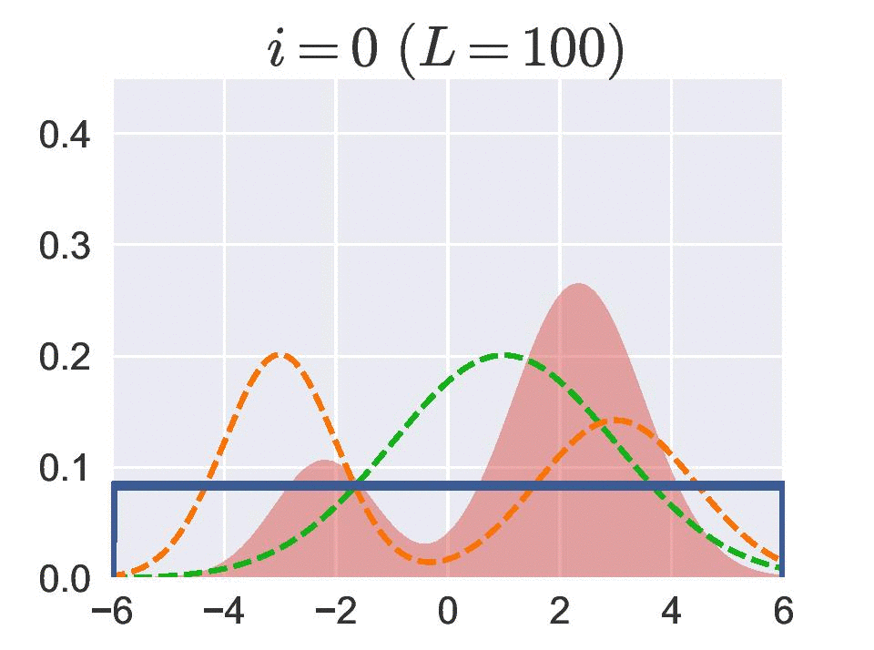

# Federated Generalized Bayesian Learning via Distributed Stein Variational Gradient Descent (DSVGD)

Distributed Stein Variational Gradient Descent (DSVGD), is a non-parametric generalized Bayesian inference framework for federated learning. 
DSVGD maintains a number of non-random and interacting particles at a central server to represent the current iterate of the model global posterior. 
The particles are iteratively downloaded and updated by one of the agents with the end goal of minimizing the global free energy. 
By varying the number of particles, DSVGD enables a flexible trade-off between per-iteration communication load and number of communication rounds. 
DSVGD is shown to compare favorably to benchmark frequentist and Bayesian federated learning strategies while also providing well-calibrated, and hence trustworthy, predictions.


This repository contains the code for the different experiments conducted in the paper:
[Federated Generalized Bayesian Learning via Distributed Stein Variational Gradient Descent](https://arxiv.org/pdf/2009.06419.pdf), namely, Bayesian Logistic Regression, Regression
with Bayesian Neural Networks and Multi-label classification with Bayesian Neural Networks. We also include the code for different benchmarks used in each experiment, namely:
- Federated Averaging (FedAvg) [(McMahan et al., 2017)](http://proceedings.mlr.press/v54/mcmahan17a/mcmahan17a.pdf).
- Distributed Stochastic Gradient Langevin Dynamics (DSGLD) [(Ahn et al., 2014)](http://proceedings.mlr.press/v32/ahn14.pdf).
- Stochastic Gradient Langevin Dynamics (SGLD) [(Welling & Teh., 2011)](http://www.icml-2011.org/papers/398_icmlpaper.pdf).

## Toy Example: 1-D Mixture of Gaussians
In the example below, green and orange dashed curves correspond to the local posterior at agents 1 and 2 scheduled during odd and even global iteration index *i* respectively. 
The shaded area represents the optimal normalized 
global posterior (obtained by normalizing the product of the two local posteriors) to be approximated at both agents. The blue solid line represents a Kernel Density Estimate
over the particles of the scheduled agents after *L* local SVGD iterations. A uniform *U(-6, 6)* prior is used. Notice that at *i=1*, agent 1 obtains an approximation of its 
local posterior while at *i=2*, agent 2 integrates the knowledge from agent's 1 approximation with its local posterior to obtain a bi-model distribution.



## Required Packages
We use Numpy v1.18.1, PyTorch v1.3.1 and Theano v1.0.4 for the Bayesian Neural Networks experiments.

## Usage
Each experiment folder contains one main .py file per algorithm. When executed, it prints the performance of the corresponding algorithm as function of the communication rounds. 
Algorithms use general purpose functions in the ```Libray/general_functions.py``` file and experiment_name specific functions in the ``` Library/experiment_name.py``` file.

## Citation
If you find this repository helpful, please consider citing [our paper](https://arxiv.org/pdf/2009.06419.pdf) using the following BibTeX entry:
```
@article{kassab2020federated,
  title={Federated Generalized Bayesian Learning via Distributed Stein Variational Gradient Descent},
  author={Kassab, Rahif and Simeone, Osvaldo},
  journal={arXiv preprint arXiv:2009.06419},
  year={2020}
}
```

## Feedback
If you have any questions, suggestions or would like to discuss or collaborate, feel free to [drop me an email](rahif.kassab@kcl.ac.uk).
